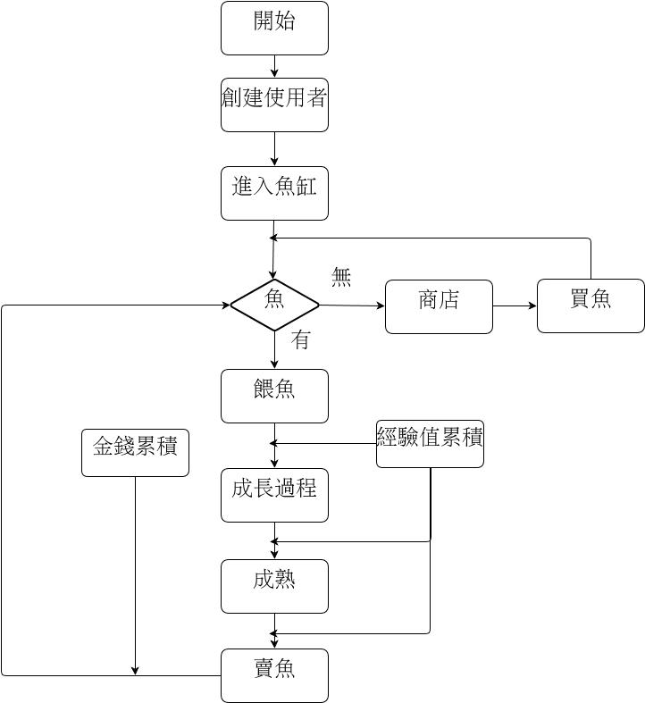
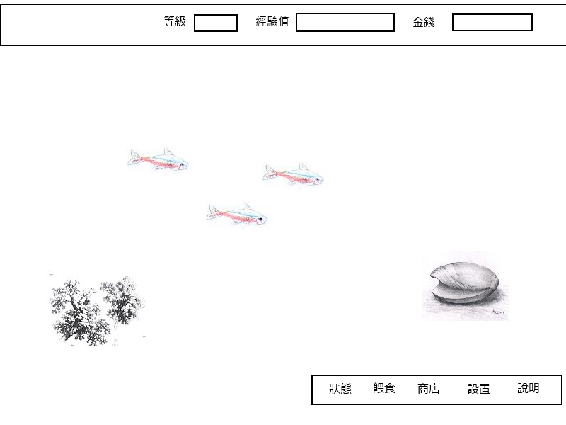
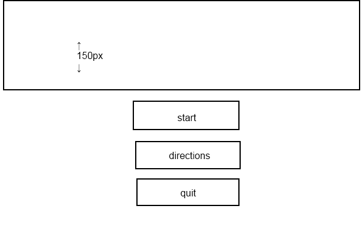
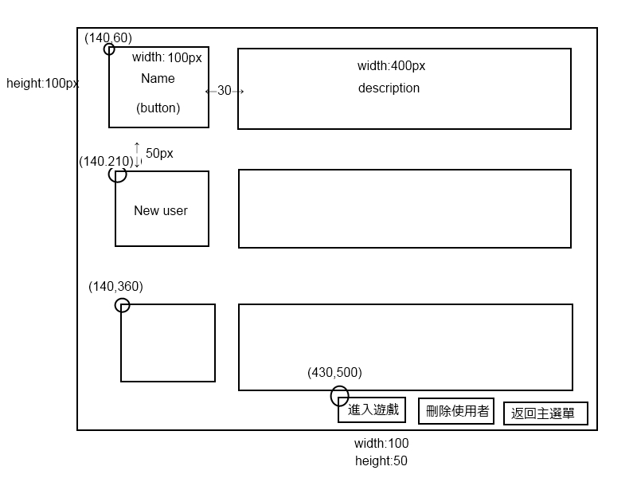
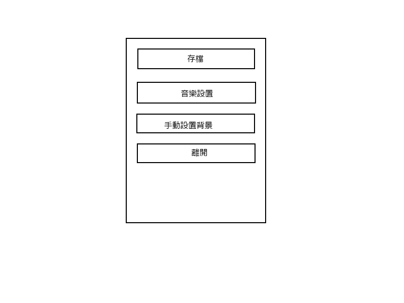
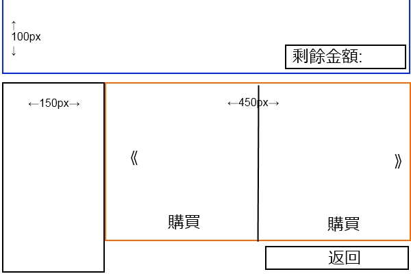
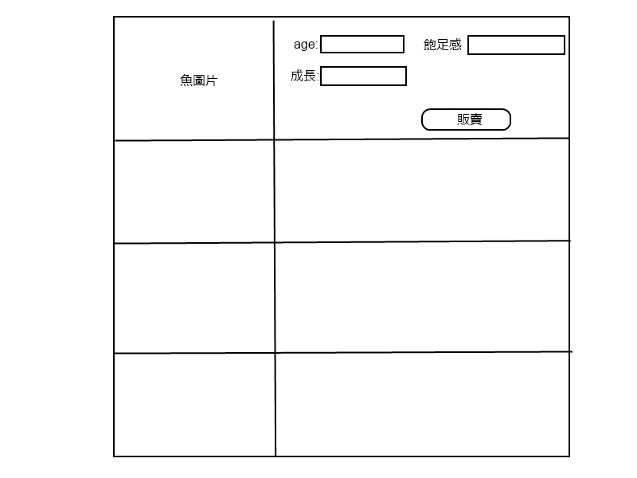

Bowl Aquarium Document
=========

Freshman project in "Introduction of Computer Science". Last updated 11/28/2013.

--

Final Project
-----------------------

專案名稱: Bowl

描述: 設計一個養魚遊戲

遊戲功能: 買魚、餵魚、賣魚

使用:

1. Using Inheritance and Polymorphism
2. Using Exception Handling
3. Using Abstract Classes and Interface
4. Event­Driver Programming
5. Using Graphical User Interfaces
6. File I/O (optional)
7. JPanel、JLabel、JButton、ImageIcon
8. ActionListener、TimeListener

創建四個 class:

Bowel class:

    (set frame)

FrameWork:

    JPanel jp_title
    JPanel jp_main
    JPanel jp_option
    JLabel user_grade
    JLabel user_experience
    JLabel user_money
    JButton jb_fish_status
    JButton jb_fish_feeding
    JButton jb_fish_shop
    JButton jb_setFrameWork
    JButton jb_exit

User class:

    private member:
        string username
        double money
        double experience

Fish class:

    private member:
        int age
        boolean satiety
        int speed
        double position_x
        double position_y
        ImageIcon fish_Image

流程圖:

GUI:

